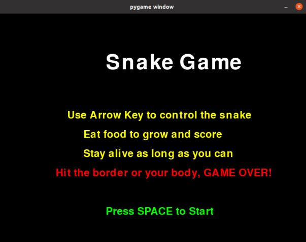
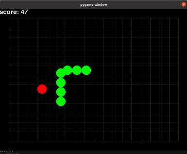
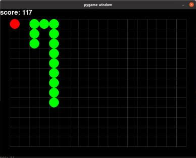
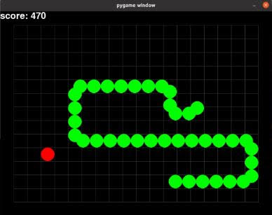
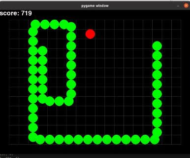
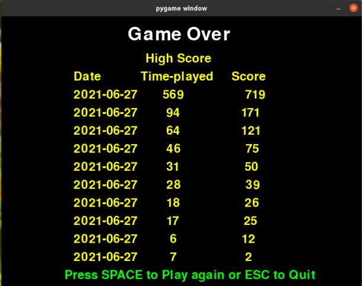

## Game Intro
This is a simple snake game! You are controlling the snake to eat food. Don't hit the border or your own body. Let's see your best score!

## Rules

- Designed for one player.

- Using the Arrow key (up, down, left, right) to move.

- Score as much as possible, stay alive as long as possible.

- Game over when hit the border.

- Game over when hit your own body.

- One food type.

- Only one life. If you die, you need to startover.

- The player accrues points for every 3 seconds of game play.

- Startup screen with instrutions.

- The scores are displayed on the left top corner of the screen.

- The date, the total time played, and the score is saved to a JSON.

- A leaderboard of 10 highest scores is presented at the end.

- Able to play again.

## Game play

